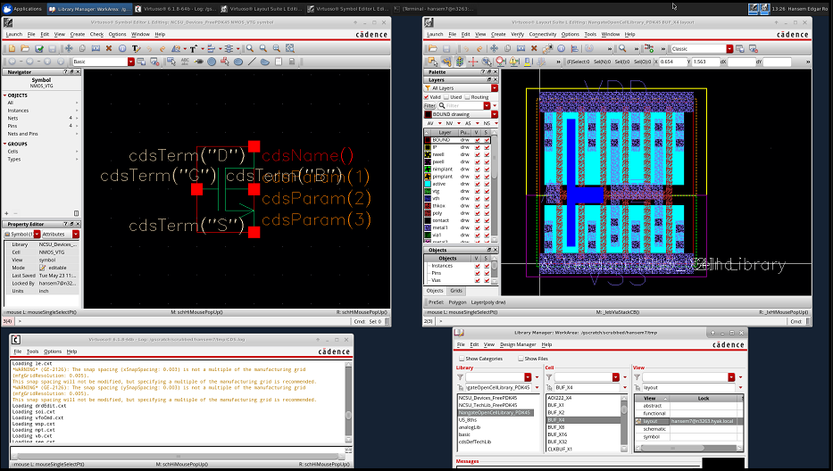

Tutorial: FreePDK45 and Si2 OpenCellLibrary Install
=======================================================

Maintained by Hansem Ro (`hansemro@outlook.com`).

## Cadence IC/Virtuoso



### Install

```bash
git clone git@bitbucket.org:psy_lab/freepdk45_opencelllibrarypdk45.git -C kits
export PDK_DIR=$PWD/kits/FreePDK45
mkdir cadence
cd cadence
## setup.csh will copy files needed for Cadence Virtuoso to the current working directory
$PDK_DIR/ncsu_basekit/cdssetup/setup.csh
```

### Usage

With `PDK_DIR` set to FreePDK45 directory, launch `virtuoso` inside the
`cadence` directory.

### Calibre DRC/LVS

TODO
